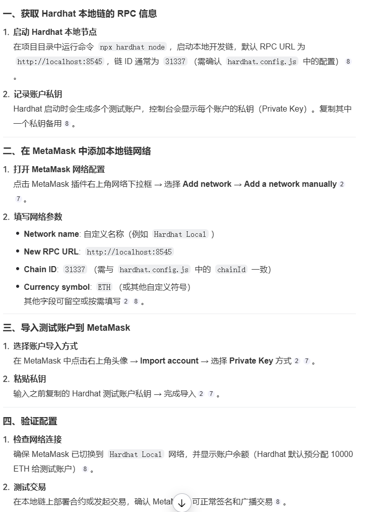

# Sample Hardhat Project

This project demonstrates a basic Hardhat use case. It comes with a sample contract, a test for that contract, and a script that deploys that contract.

Try running some of the following tasks:

```shell
npx hardhat help
npx hardhat test
REPORT_GAS=true npx hardhat test
// 新建空白react项目
npx create-react-app artist
// 新建 headhat项目
npx hardhat
// 启动一个本地区块链
npx hardhat node
// 本地测试
npx hardhat test --network localhost
//  指定网络 部署合约 本地网络
npx hardhat run scripts/deploy.ts --network localhost
// 配置matemask 本地网络，添加 本地网络提供的两个账号

```

一、配置本地区块链网络 npx hardhat node
启动 hardhat node 后，配置 matemask 的本地网络 ，添加本地账号


二、配置，前端 react 项目
三、配置，文件存储的 arweave
1、开发链 npx arlocal
2、在https://arweave.app/add 创建新钱包，拿到 address
3、在 设置 里面 ，配置 gateway 为：http://127.0.0.1:1984
4、领取测试币，：http://127.0.0.1:1984/(address)/(balance)
5、挖矿,拿到测试币：http://127.0.0.1:1984/mine
6、前端项目链接 arweave，查看 connectIpfs.js 里面的配置
7、
