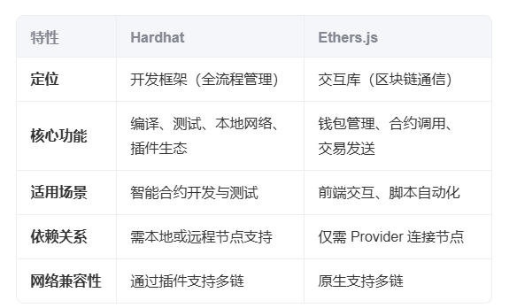

### npm 常用：

npm install --save-dev 是用来把包添加到 devDependencies 里的
npm i -D

### 项目创建流程

```
// 安装hardhat
npm install hardhat -D
// 创建一个 hardhat 项目,选择 js
npx hardhat
// 启动一个本地区块链
npx hardhat node
// 安装 chainlink/contracts
npm install @chainlink/contracts
// 编译contracts 下面所有 合约 结果在 artifacts 文件夹里面
npx hardhat compile
//
npx hardhat deploy // 创建了 deploy task
npx hardhat run scripts/deploy.js // 跑自己创建的脚本
//  指定网络 部署合约
npx hardhat run scripts/deploy.js --network sepolia
// 可以配置 .env
// 使用 require("dotenv").config();
// const SEPOLIA_RPC_URL = process.env.SEPOLIA_RPC_URL;
npm install dotenv
// 使用 加密变量
//
npm install -D  @chainlink/env-enc
// 验证 部署
// 需要注册 etherscan.io  账号rabinp Web3@_;,
// 就会看到网站上 contract 有对号
npx hardhat verify --network sepolia  0x5C3B01b4b4E6263f5b33Ec3EB66962F1A8a2e025 "300"

// headhat tasks 任务
// npx hardhat help 就能看到可以执行的任务
// 部署合约 npx hardhat deploy-crow --network sepolia
// 交互合约 npx hardhat interact-crow --network sepolia --addr 0x7a1d4c2f3b5e8c6f9e4d5b5e5f5f5f5f5f5f5f5f(上一个task部署成功的合约地址)
```

#### hardhat 介绍

‌Hardhat 介绍 ‌
Hardhat 是一个基于 JavaScript 的 ‌ 以太坊智能合约开发框架 ‌，专注于提供完整的开发、测试和部署工具链。其核心功能包括：

- 本地开发网络 ‌：内置 Hardhat Network，支持快速启动本地以太坊节点，提供调试功能（如交易回退、堆栈跟踪）‌45。
- ‌ 智能合约编译与部署 ‌：通过插件（如 @nomicfoundation/hardhat-toolbox）支持 Solidity 编译、合约部署及版本管理 ‌36。
- ‌ 测试与调试 ‌：集成 Mocha/Chai 测试框架，支持编写单元测试和集成测试，并提供详细的错误日志 ‌57。
- ‌ 插件生态 ‌：可扩展性强，支持集成 TypeScript、Ethers.js、Waffle 等工具 ‌46。
- ‌ 生产环境适配 ‌：被 Chainlink、Uniswap 等主流项目采用，适用于复杂 DApp 开发 ‌5。

### ehters.js 介绍

Ethers.js 介绍 ‌
Ethers.js 是一个轻量级 ‌ 以太坊交互库 ‌，专注于简化与区块链网络的通信和合约操作，核心模块包括：

- ‌Provider‌：连接以太坊节点（如 Infura、本地节点），提供只读的区块链数据访问 ‌67。
- ‌Signer‌：管理账户私钥，支持离线签名和交易发送 ‌6。
- ‌Contract‌：通过 ABI 与智能合约交互，支持方法调用和事件监听 ‌67。
- ‌ 跨网络兼容性 ‌：支持多链（如 Polygon、BSC），无需依赖全节点即可操作 ‌1

### 核心区别


