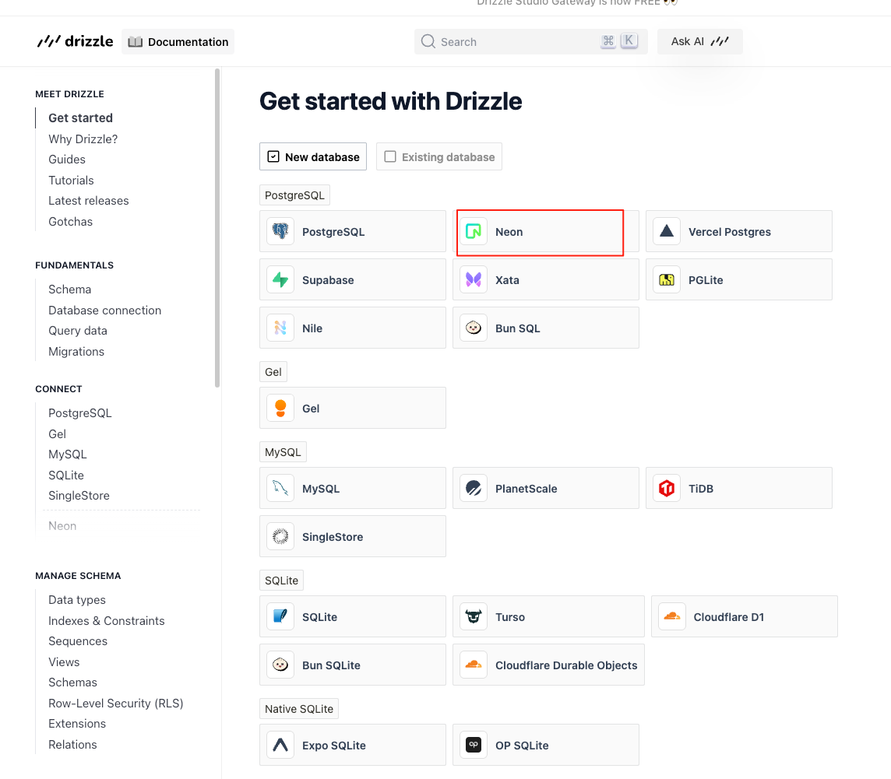

<!--
 * @Author: xudesong jake2020520@gmail.com
 * @Date: 2025-08-16 09:47:01
 * @LastEditors: xudesong jake2020520@gmail.com
 * @LastEditTime: 2025-08-17 14:04:24
 * @FilePath: /new-tube/readme/readme.md
 * @Description: 这是默认设置,请设置`customMade`, 打开koroFileHeader查看配置 进行设置: https://github.com/OBKoro1/koro1FileHeader/wiki/%E9%85%8D%E7%BD%AE
-->

一、固定安装环境

```
bun 1.1.20
node 20.15.1
```

二、安装
// 安装 next
npm install -g bun
bunx create-next-app@15.1.6
// 安装 shadcn 组件库
bunx --bun shadcn@2.1.8 init
bunx --bun shadcn@2.1.8 add --all
三、数据库
3.1 www.neon.tech 注册账号 rabinp 浏览器账号
新建项目： new-tube 选择 azure


3.2 链接数据库 工具
https://orm.drizzle.team/docs/get-started
bun add drizzle-orm @neondatabase/serverless dotenv
bun add -D drizzle-kit tsx


// 先配置 drizzle.config.ts 生成数据库 模型
// 同步 schema 模型到数据库
bunx drizzle-kit push

// 可视化数据库
bunx drizzle-kit studio

四、本地开发测试连接的配置
免费的静态域名
[ngrok 安装](https://www.ngrok.com/) 浏览器账号登录


ngrok http --url=flexible-loyal-yeti.ngrok-free.app 80
ngrok http --domain=flexible-loyal-yeti.ngrok-free.app 3000

或者用组合命令
bun run dev:all

添加 CLERK_SIGNING_SECRET=whsec_FBXVPfFUwynI9jicEuoEQ6W8KHkttL+D
就可以同步修改 clerk 里面的 登录用户的数据了

五、安全调用接口
[trpc 安全调用接口](https://trpc.io/docs/client/react/server-components)
"@trpc/client": "^11.4.2",
"@trpc/react-query": "^11.4.2",
"@trpc/server": "^11.4.2",
"@trpc/tanstack-react-query": "^11.4.2",
"client-only": "^0.0.1",
"server-only": "^0.0.1",


六、性能优化
[redis 安装](https://console.upstash.com/redis/e64bebb4-48a7-4953-8f6d-86307e51722e?teamid=0) 浏览器账号
"@trpc/tanstack-react-query": "^11.4.2",
"@uploadthing/react": "^7.3.2",
"@upstash/ratelimit": "^2.0.5",
"@upstash/redis": "^1.35.0",
"@upstash/workflow": "^0.2.14",


七、数据处理
初始化数据 bun src/scripts/seed-categories.ts

八、视频的存储

https://dashboard.mux.com/login 浏览器账号登录的

"@mux/mux-node": "^11.0.2",
"@mux/mux-player-react": "^3.5.0",
"@mux/mux-uploader-react": "^1.2.0",


